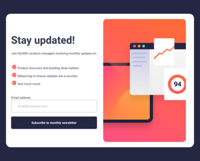

# Frontend Mentor - Newsletter sign-up form with success message solution

This is a solution to the [Newsletter sign-up form with success message challenge on Frontend Mentor](https://www.frontendmentor.io/challenges/newsletter-signup-form-with-success-message-3FC1AZbNrv). Frontend Mentor challenges help you improve your coding skills by building realistic projects. 

## Table of contents

- [Overview](#overview)
  - [The challenge](#the-challenge)
  - [Screenshot](#screenshot)
  - [Links](#links)
- [My process](#my-process)
  - [Built with](#built-with)
  - [Continued development](#continued-development)
  - [Useful resources](#useful-resources)
- [Author](#author)
- [Acknowledgments](#acknowledgments)

**Note: Delete this note and update the table of contents based on what sections you keep.**

## Overview

### The challenge

Users should be able to:

- Add their email and submit the form
- See a success message with their email after successfully submitting the form
- See form validation messages if:
  - The field is left empty
  - The email address is not formatted correctly
- View the optimal layout for the interface depending on their device's screen size
- See hover and focus states for all interactive elements on the page

### Screenshot

### Links

- Solution URL:  https://www.frontendmentor.io/challenges/newsletter-signup-form-with-success-message-3FC1AZbNrv/hub

- Live Site URL: https://newletter-signup-six.vercel.app/

## My process

### Built with

- Semantic HTML5 markup
- CSS custom properties
- Flexbox
- CSS Grid
- Desktop-first workflow

### Continued development

- Just going to keep doing more challenges and practicing javascript

### Useful resources

- https://www.youtube.com/watch?v=vrFnwDJmvBk - This helped me a lot with setting up a re-usable js validation script. I really liked this pattern and will use it going forward. His handle is codebubb

- https://www.youtube.com/watch?v=MBaw_6cPmAw - Kyle @ webdev simplified is where I got the code for the modal. Just made a few tweeks and here we go.

## Author

- Frontend Mentor - [@jwren4170] https://www.frontendmentor.io/profile/jwren4170

